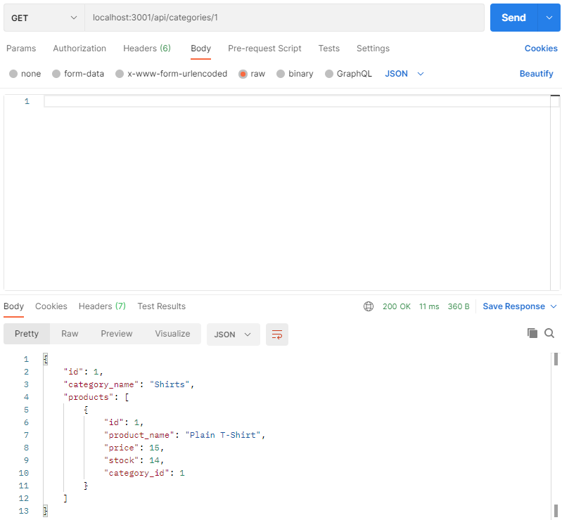

# ORM E-Commerce Practice

## Description 
>*Seed a database with MySQL data that can be manipulated with Sequelize and API routes via Node.js, Express.js and Postman (or Insomnia).*

-----------

-----------
## Table of Contents

* [Installation and 'How to' Video](#installation)

* [Usage](#usage)

* [License](#license)

* [Contributing](#contributing)

* [Tests](#tests)

* [Resources](#resources)

* [Questions](#questions)

-----------
## Installation 
>[Click Here To Watch How To Video](https://drive.google.com/file/d/188J481mQIIEc-15EfGHY1GzXk-R-oVML/view)

-----------

## Usage 
The following commands can be typed into MySQL bash, but I found it easier to create an ecommerce_db database within my preferred GUI (TablePlus).
`mysql -u root -p` 
`source db/schema.sql`
`quit`

This project isn't complete, so if you would like to view it to learn more about separations of control, Sequelize, Express and more, feel free to use it however you'd like.

-----------

## License 
This project was created under the MIT License.

-----------

## Contributing 
Feel free to reach out if you would like to contribute on this. Personally I am going to wait to work on databases until I am either with a more experienced employer or better understand security, but if you search this topic on YouTube you are bound to find many fully-fledged e-commerce tutorials.

-----------

## Tests 
To practice test data, first create a database named `ecommerce_db` inside your GUI (I use TablePlus, others use Workbench, etc.), then run `npm install` from within the main directory inside your terminal. Once you have installed the packages that correlate with the project (can verify in your package.json), enter the code `npm run seed`, which will seed all of the JavaScript files within the seeds folder into the database. Finally, type `node server.js` and refresh your TablePlus database (make sure to be inside ecommerce_db). If you see data, you are good to test the api routes!

-----------

## Resources
[Sequelize Docs: Model](https://sequelize.org/master/class/lib/model.js~Model.html)
 
[YouTube: Inserting Data in Sequelize](https://www.youtube.com/watch?v=JAld7bV5qV8)
 
[.then(), .catch(), .finally() to Handle Errors](https://lucymarmitchell.medium.com/using-then-catch-finally-to-handle-errors-in-javascript-promises-6de92bce3afc)
 
[Async functions - making promises friendly](https://developers.google.com/web/fundamentals/primers/async-functions)
 
[YouTube: Sequelize Many to Many](https://www.youtube.com/results?search_query=sequelize+many+to+many)
 
[Insomnia: Getting Started](https://www.youtube.com/watch?v=4tZdAf60OzI)
 
[SQLDBM: Develop Online](https://sqldbm.com/Home/)
 
[Sequelize Docs: HasMany](https://sequelize.org/master/class/lib/associations/has-many.js~HasMany.html)
 
[Sequelize Docs: BelongsToMany](https://sequelize.org/master/class/lib/associations/belongs-to-many.js~BelongsToMany.html)
 
[JawsDB MySQL](https://devcenter.heroku.com/articles/jawsdb)

[SQLBOLT - Learn SQL](https://sqlbolt.com/)

[Sequelize Docs: Hooks](https://sequelize.org/master/manual/hooks.html)

[Determine MySQL Version from Command Line](https://webcheatsheet.com/sql/Determine_MYSQL_Version_From_the_Command_Line.php)
 

 
-----------

## Questions 
GitHub: https://github.com/Pythonidaer

For additional information, please reach out to codefolio.work@gmail.com

 